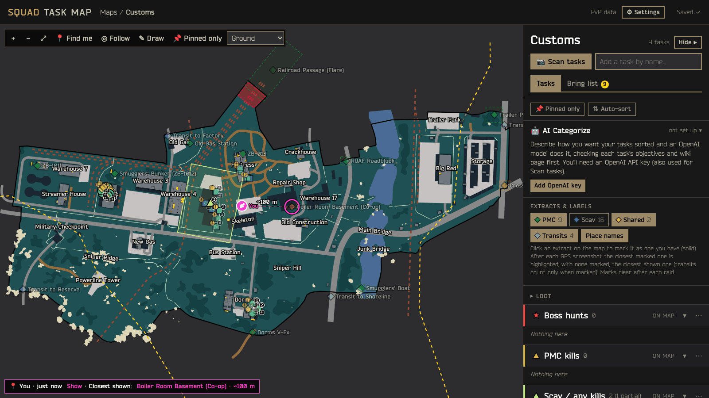
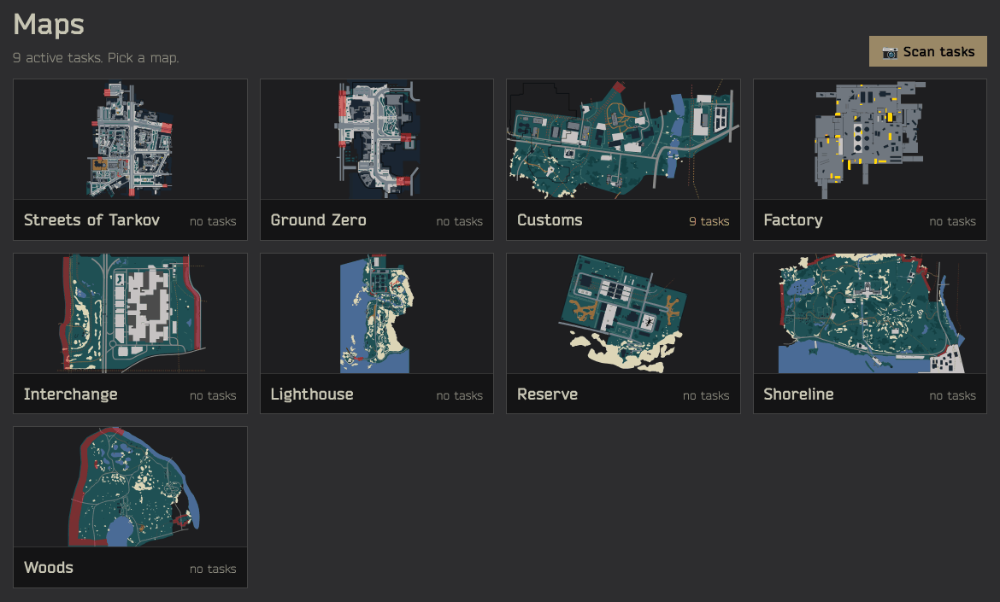
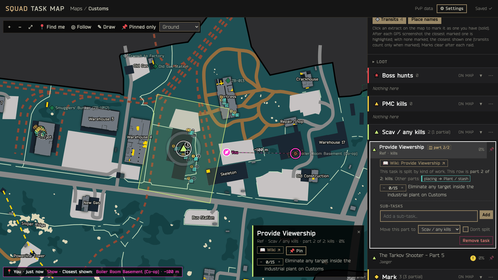
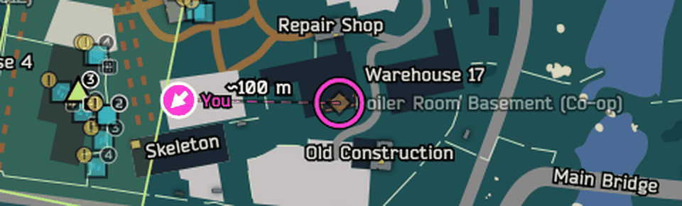
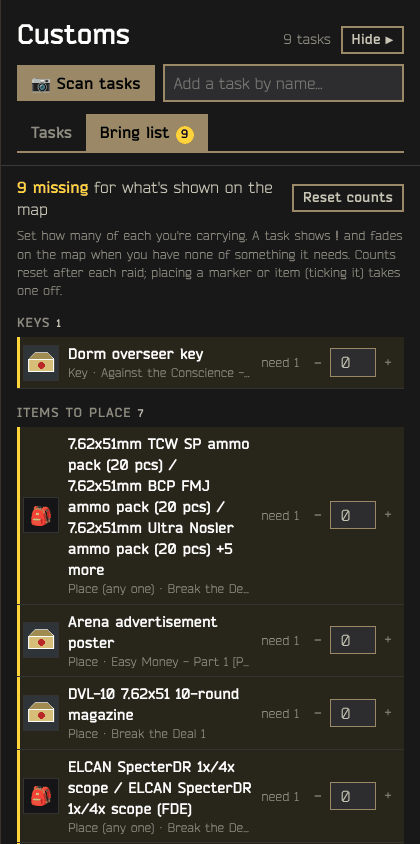
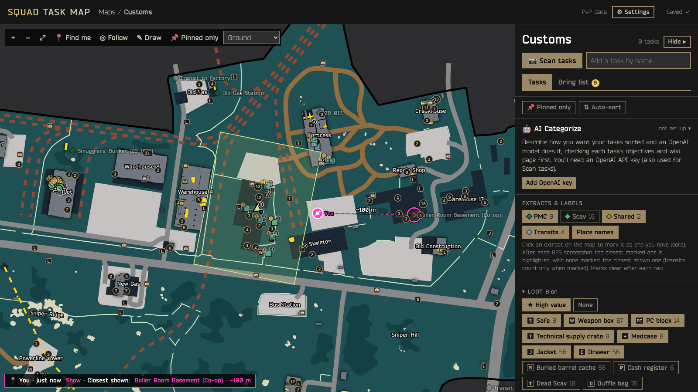
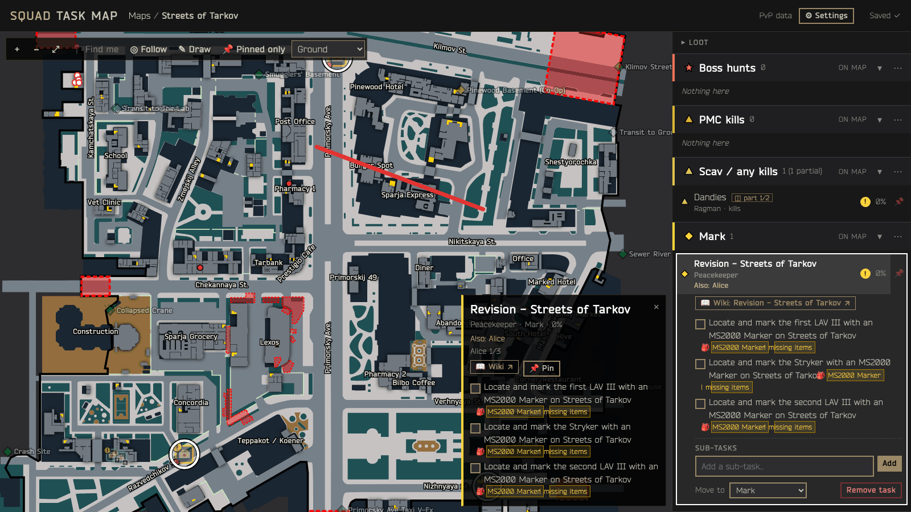

# Squad Task Map

**A Tarkov task map that runs on your own PC and keeps itself in sync with the game.**

Squad Task Map is a small Windows program for Escape from Tarkov. It shows the tasks you actually have on each map, split by kind of work (boss hunts, kills, placing, retrieving…), with what you need to bring. It follows the game while you play: it reads Tarkov's log files and screenshot names, so accepted and finished tasks update by themselves and your position shows on the map.

- One `.exe`, about 28 MB. Nothing to install, no account.
- The map page opens in your browser at `http://127.0.0.1:7777` and only listens on your own PC.
- It's built to stay light next to a CPU-bound game: idle CPU is practically zero.



## Download

Get the latest `SquadTaskMap.exe` from **[Releases](https://github.com/01Never/EFT-Squad-Task-Map/releases/latest)**. Put it in its own folder (for example `Documents\SquadTaskMap`) and double-click it.

Windows SmartScreen may say "Windows protected your PC" the first time, because the program isn't code-signed. Click **More info → Run anyway**.

## What it does

### Your tasks, per map
Pick a map and see a marker for every objective of the tasks you have, grouped into categories (boss hunts, kills, placing, retrieving…) that you can rename, recolour and reorder. Tasks you accept or finish in-game are added or removed within seconds, from the game's log files. Where you have to place something, the marker shows the item's icon.



Click a marker or a row to select a task: its spots flash on the map, and the popup and the list show every objective with ticks and counters, the wiki link, sub-tasks and pins.



### Where you are, and your way out
Tarkov puts your position and facing in each screenshot's file name. Take a screenshot in raid and your marker appears with a short pulse; an off-screen pointer brings you back, and **Follow** keeps the map centred on you. The closest of your extracts gets a ring and a thin line with the distance. Open the in-game extract list (double-tap O) before that screenshot and, with an OpenAI key, the app reads it and marks your extracts for you.



### Bring list
The keys, items to place and gear the tasks on the map need. Set how many you have; spots you can't do yet fade and get a "!".



### Loot spots
Safes, weapon boxes, PC blocks, jackets, filing cabinets and notable loose loot from tarkov.dev, per type or with one **High value** click. Small and secondary to your task markers.



### Squad
Join friends with an invite code: a private Tailscale network is built into the exe, nothing else to install. See each other's drawings live, and, if you both choose, each other's tasks with "Also: Alice" and progress on the tasks you share.



### And more
- **Scan your task list:** screenshot the in-game Tasks screen and an OpenAI vision model reads it, so your list matches the game exactly (optional, your own API key).
- **AI Categorize:** sort tasks by plain-English instructions, checked against each task's wiki page (optional).
- **Draw** on the map, **pin** tasks, add **sub-tasks**, and switch between PvP and PvE data.
- **Check for updates** in Settings: signed releases from this repo, installed with one click.

The full manual is the **[user guide](docs/USER-GUIDE.md)**: setup, every feature, settings, privacy, and the files the app keeps next to the exe.

## Privacy

The app contacts GitHub only when you click Check for updates. If you join a squad, your drawings (and your tasks, only if you turn that on) go directly to your friends' copies over a private Tailscale network; Tailscale relays traffic when two PCs can't connect directly but can't read it. Never joined, nothing of this runs. Everything else stays on your PC except downloads of game data (json.tarkov.dev), item icons (assets.tarkov.dev), wiki pages for AI Categorize, and, only if you add a key, requests to api.openai.com (the task scan's screenshots, AI Categorize, and **the first in-raid screenshot of each raid** so your extracts can be marked for you; that one can be turned off in Settings). Your OpenAI key stays in the settings file on your PC and is sent nowhere else. The app deletes only screenshots you confirmed in a scan, and the GPS screenshots of the raid that just ended.

## Building from source

The server is Go and the page is plain JavaScript modules with no bundler. You need Go 1.27+, and Node 24+ for the page tests.

```powershell
go run .                    # run from source; page edits show on reload
go test ./...               # server tests
npm test                    # page logic tests
npm run test:browser        # end-to-end browser suite (see tests/browser/README.md)
go build -trimpath -ldflags "-s -w" -o dist/SquadTaskMap.exe .
```

The icon and version info come from `rsrc_windows_amd64.syso`, made from `winres/` with `go-winres make --arch amd64 --out rsrc`.

**Offline development:** `go run ./cmd/mock` serves stand-ins for json.tarkov.dev, OpenAI and the wiki on port 7820. Point the app at it with `STM_JSON_BASE=http://127.0.0.1:7820`, `STM_OPENAI_API=http://127.0.0.1:7820/v1` and `STM_WIKI_API=http://127.0.0.1:7820/wiki`. Use a scratch `STM_DATA_DIR` so your real data isn't touched. Other variables: `STM_LOGS_DIR`, `STM_SCREENSHOTS_DIR`, `STM_NO_BROWSER=1`, `PORT`, `STM_ASSETS_DIR`.

### Where to start reading

| Path | What |
|---|---|
| `internal/app/app.go` | How every part connects. Read this first. |
| `internal/features/<name>/` | One Go package per feature, with `rules.go` and a README. |
| `web/js/` | The page. `web/js/features/<name>/` holds the newer features. |
| `cmd/mock/` | Offline stand-ins for the web services. |
| `docs/FEATURES.md` | Every feature with its Go package and page folder. |
| `docs/ROADMAP.md` | The tickets being built, in order. |
| `docs/CODE-STYLE.md` | How code is written here. |
| `docs/HANDOFF.md`, `docs/SPEC.md` | Developer handoff and the v2 design. |
| `.claude/agents/` | Role briefs for the Claude Code agents that work on this repo. |

## Credits

- Map art: Shebuka and contributors, [the-hideout/tarkov-dev-svg-maps](https://github.com/the-hideout/tarkov-dev-svg-maps) (CC BY-NC-SA 4.0; non-commercial use only).
- The Labyrinth's map art: the map images from [tarkov.dev](https://tarkov.dev) (the-hideout/tarkov-dev, MIT project), stitched from their map tiles.
- Map projection, palette and Bender font: the [tarkov.dev](https://github.com/the-hideout/tarkov-dev) project (MIT).
- Game data: tarkov.dev (community).
- Log and screenshot formats learned from TarkovMonitor (GPL-3.0); no code copied.
- Not affiliated with Battlestate Games.
